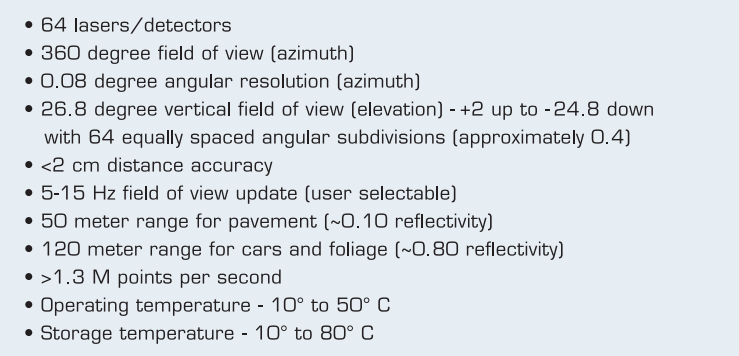

# Lesson 1: Introduction to Lidar and Point Clouds
## LIDAR (Light Detecting and Ranging) 

Lidar sensing involves the emission of thousands of infrared laser signals at various angles, covering a 360-degree range. These signals bounce off objects, returning to the sensor. By measuring the time it takes for the signals to return, Lidar calculates the distance to these objects with high precision. Additionally, the intensity of the reflected signals can be measured to gain insights into the material properties of the objects. While Lidar provides accurate 3D models of the surrounding environment, it is currently quite expensive, often exceeding $60,000 for a standard unit.

## HDL 64 Lidar Specifications

<div style="text-align:center;">
    
</div>

Velodyne lidar sensors, with HDL 64, HDL 32, VLP 16 from left to right. The larger the sensor, the higher the resolution.

- **Number of Layers:** 64 layers, each sent out at a different angle from the z-axis, providing varying inclines for comprehensive coverage.

- **Angular Resolution:** Each layer has an angular resolution of 0.08 degrees, ensuring fine detail in the scanned data.

- **Scanning Rate:** On average, the Lidar scans ten times a second, rapidly capturing data points for real-time analysis.

- **Maximum Range for Cars and Foliage:** It can detect objects such as cars and foliage at distances of up to 120 meters, making it suitable for long-range applications.

- **Pavement Detection Range:** The Lidar is capable of sensing pavement surfaces up to a range of 50 meters, which is valuable for navigation and road analysis.

These specifications highlight the Lidar's ability to provide high-resolution, multi-layered data with impressive range and precision, making it suitable for various applications in areas like autonomous vehicles, mapping, and environmental monitoring.

<div style="text-align:center;">
    
</div>

<div style="text-align:center;">
    
</div>

## Point Cloud

Lidar data is typically stored in a format called Point Cloud Data (PCD). A .pcd file represents a single snapshot of the environment, containing (x, y, z) Cartesian coordinates along with intensity values (i). For example, with a VLP 64 Lidar, a single .pcd file would contain approximately 256,000 (x, y, z, i) data points, capturing the spatial information and intensity data from a single scan.
The coordinate system used for point cloud data aligns with the car's local coordinate system. In this system:

- The x-axis points towards the front of the car.
- The y-axis points to the left of the car.
- The z-axis points up above the car.

This coordinate system follows the right-handed convention, where you can use your right hand to visualize the positive direction of each axis.

<div style="text-align:center;">
    
</div>

## Point Cloud Library

<div style="text-align:center;">
    
</div>

In this module, the focus is on processing point cloud data within a C++ environment. Prior familiarity with C++ can be advantageous for participants. The primary tool used for this purpose is the Point Cloud Library (PCL), an open-source C++ library specifically designed for manipulating point cloud data. PCL will be utilized for tasks such as data visualization, rendering shapes, and leveraging its built-in processing functions.
The robotics community widely adopts PCL for handling point cloud data, and there are ample online tutorials available for guidance. The module will utilize various PCL functions, including Segmentation, Extraction, and Clustering, to identify obstacles within point cloud data.

## Excersise 1: Lidar object and Point cloud in simulation [f6f591b](https://github.com/LeisAlAyoubi/SFND_Lidar_Obstacle_Detection/commit/d3061c10a49d5b3aa8673b5f67b2cf7f6f6f591b)

### 1. Create a lidar object

In the "simpleHighway" function of the code, a Lidar object was instantiated. This Lidar object, as defined in the "src/sensors/lidar.h" header file, was included at the beginning of the "environment.cpp" file. The instantiation involved creating a pointer to a Lidar object on the heap using the "new" keyword.
The Lidar constructor took two arguments: "cars" and the "slope of the ground." These arguments were essential for modeling ray collisions in the Lidar object. For this instantiation, the Lidar object was created with a slope of 0.
It's worth noting that the use of a pointer and instantiation on the heap was chosen due to the potential size of the Lidar object, which could hold large point cloud data. Heap allocation provided more memory space than the stack but resulted in slower object lookup compared to the faster stack lookup.
In the exercise, the task was to create a point cloud by calling the "lidar scan()" method on the Lidar object. The results were stored in a PointCloud pointer object of type "pcl::PointCloudpcl::PointXYZ::Ptr," with the point type specified as "pcl::PointXYZ."
To visualize the point cloud data, the "renderRays" function was called. This function, which was defined in "src/render," allowed the rendering of lidar rays as line segments in the pcl viewer.

<div style="text-align:center;">
    
</div>

### 2. Adjust the lidar parameters

The changes made to the Lidar configuration involve several adjustments:
- Increasing the minimum distance: This modification prevents the inclusion of contact points from the roof of the car in the captured data.
- Increasing both horizontal and vertical angle resolution: This enhances the level of detail and accuracy in the Lidar's scanning process, providing more comprehensive data.
- Adding noise: A significant amount of noise is introduced, measured in meters. This substantial noise level contributes to more realistic and interesting point data in the scene.

<div style="text-align:center;">
    
</div>

### 3. Examine the point cloud
To view the point cloud data, the "renderPointCloud" function in the "render" module can be utilized. Optionally, it's possible to disable rendering for the highway scene to examine the point cloud in isolation. By setting a higher "minDistance," it becomes possible to eliminate points that represent contact with the roof of the car, as these are not useful for detecting other vehicles. Furthermore, introducing some level of noise variance is beneficial, as it enhances the visual complexity of point clouds. Additionally, adding noise is instrumental in developing more robust point processing functions.

<div style="text-align:center;">
    
</div>

# Lesson 2: Point Cloud Segmentation

In the point cloud data, objects that appear but are not obstacles generally include:

1. **Free Space on the Road**: Open, unoccupied spaces on the road where there are no obstacles, such as empty lanes or gaps between vehicles.

2. **Road Surface**: When the road is flat, it's relatively straightforward to distinguish road points from non-road points. The road surface itself is not considered an obstacle.

To identify and separate these non-obstacle elements, a technique called Planar Segmentation is commonly employed. Planar Segmentation utilizes the RANSAC (Random Sample Consensus) algorithm, which is effective in identifying planar surfaces within the point cloud data, such as the road, and separating them from other objects or obstacles in the scene. This method aids in distinguishing between the road surface and any potential obstacles or free space.

# Sensor Fusion Self-Driving Car Course


### Welcome to the Sensor Fusion course for self-driving cars.

In this course we will be talking about sensor fusion, whch is the process of taking data from multiple sensors and combining it to give us a better understanding of the world around us. we will mostly be focusing on two sensors, lidar, and radar. By the end we will be fusing the data from these two sensors to track multiple cars on the road, estimating their positions and speed.

**Lidar** sensing gives us high resolution data by sending out thousands of laser signals. These lasers bounce off objects, returning to the sensor where we can then determine how far away objects are by timing how long it takes for the signal to return. Also we can tell a little bit about the object that was hit by measuring the intesity of the returned signal. Each laser ray is in the infrared spectrum, and is sent out at many different angles, usually in a 360 degree range. While lidar sensors gives us very high accurate models for the world around us in 3D, they are currently very expensive, upwards of $60,000 for a standard unit.

**Radar** data is typically very sparse and in a limited range, however it can directly tell us how fast an object is moving in a certain direction. This ability makes radars a very pratical sensor for doing things like cruise control where its important to know how fast the car infront of you is traveling. Radar sensors are also very affordable and common now of days in newer cars.

**Sensor Fusion** by combing lidar's high resolution imaging with radar's ability to measure velocity of objects we can get a better understanding of the sorrounding environment than we could using one of the sensors alone.

## Classroom Workspace

The workspace provided in the SFND classroom comes preinstallated with everything that you need to finish the exercises and projects. Versions used by Udacity for this ND are as follows:

* Ubuntu 16.04
* PCL - v1.7.2
* C++ v11
* gcc v5.5

**Note** The [[CMakeLists.txt](https://github.com/udacity/SFND_Lidar_Obstacle_Detection/blob/master/CMakeLists.txt)] file provided in this repo can be used locally if you have the same package versions as mentioned above. If you want to run this project locally (outside the Udacity workspace), please follow the steps under the **Local Installation** section.


## Local Installation

### Ubuntu 

1. Clone this github repo:

   ```sh
   cd ~
   git clone https://github.com/udacity/SFND_Lidar_Obstacle_Detection.git
   ```

2.  Edit [CMakeLists.txt](https://github.com/udacity/SFND_Lidar_Obstacle_Detection/blob/master/CMakeLists.txt) as follows:

   ```cmake
   cmake_minimum_required(VERSION 2.8 FATAL_ERROR)
   
   add_definitions(-std=c++14)
   
   set(CXX_FLAGS "-Wall")
   set(CMAKE_CXX_FLAGS, "${CXX_FLAGS}")
   
   project(playback)
   
   find_package(PCL 1.11 REQUIRED)
   
   include_directories(${PCL_INCLUDE_DIRS})
   link_directories(${PCL_LIBRARY_DIRS})
   add_definitions(${PCL_DEFINITIONS})
   list(REMOVE_ITEM PCL_LIBRARIES "vtkproj4")
   
   
   add_executable (environment src/environment.cpp src/render/render.cpp src/processPointClouds.cpp)
   target_link_libraries (environment ${PCL_LIBRARIES})
   ```

3. Execute the following commands in a terminal

   ```shell
   sudo apt install libpcl-dev
   cd ~/SFND_Lidar_Obstacle_Detection
   mkdir build && cd build
   cmake ..
   make
   ./environment
   ```

   This should install the latest version of PCL. You should be able to do all the classroom exercises and project with this setup.
   
**Note** The library version of PCL being distributed by the apt repository for 18.04 and 20.04 are both older than v1.11. The following links have the information regarding the versions-

[Bionic 18.04](https://www.ubuntuupdates.org/package/core/bionic/universe/updates/libpcl-dev)
[Focal 20.04](https://www.ubuntuupdates.org/package/core/focal/universe/base/libpcl-dev)

You can either build PCL from source (for v1.11) or use the older version.

### MAC

#### Install via Homebrew
1. install [homebrew](https://brew.sh/)
2. update homebrew 
	```bash
	$> brew update
	```
3. add  homebrew science [tap](https://docs.brew.sh/Taps) 
	```bash
	$> brew tap brewsci/science
	```
4. view pcl install options
	```bash
	$> brew options pcl
	```
5. install PCL 
	```bash
	$> brew install pcl
	```

6. Clone this github repo

   ```shell
   cd ~
   git clone https://github.com/udacity/SFND_Lidar_Obstacle_Detection.git
   ```

7. Edit the CMakeLists.txt file as shown in Step 2 of Ubuntu installation instructions above.

8. Execute the following commands in a terminal

   ```shell
   cd ~/SFND_Lidar_Obstacle_Detection
   mkdir build && cd build
   cmake ..
   make
   ./environment
   ```
If you get build errors related to Qt5, make sure that the path for Qt5 is correctly set in .bash_profile or .zsh_profile (Refer [#45](https://github.com/udacity/SFND_Lidar_Obstacle_Detection/issues/45))

### WINDOWS

#### Install via cvpkg

1. Follow the steps [here](https://pointclouds.org/downloads/) to install PCL.

2. Clone this github repo

   ```shell
   cd ~
   git clone https://github.com/udacity/SFND_Lidar_Obstacle_Detection.git
   ```

3. Edit the CMakeLists.txt file as shown in Step 2 of Ubuntu installation instructions above.

4. Execute the following commands in Powershell or Terminal

   ```shell
   cd ~/SFND_Lidar_Obstacle_Detection
   mkdir build && cd build
   cmake ..
   make
   ./environment
   ```

#### Build from Source

[PCL Source Github](https://github.com/PointCloudLibrary/pcl)

[PCL Mac Compilation Docs](https://pcl.readthedocs.io/projects/tutorials/en/latest/compiling_pcl_macosx.html#compiling-pcl-macosx)
